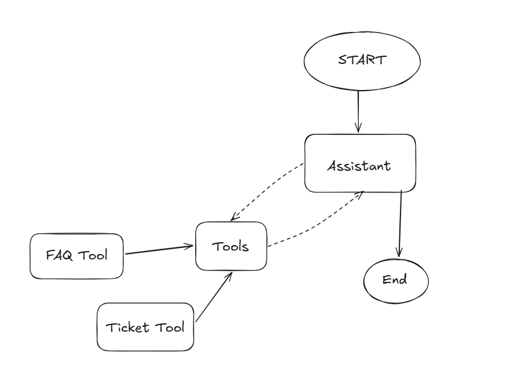
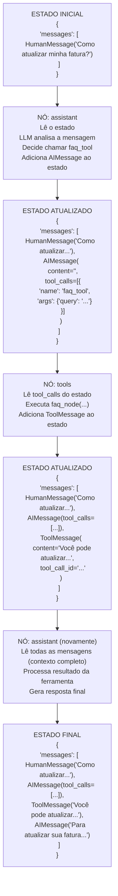

# AI Support Assistant

Um sistema inteligente de suporte ao cliente que usa **LangChain** e **LangGraph** para criar um agente capaz de:
- Responder perguntas frequentes (FAQ) de temas pré-determinados
- Abrir tickets de suporte via Telegram
- Decidir qual ferramenta usar baseado na pergunta do usuário

## Arquitetura do projeto



### Estrutura do grafo

```python
def router_node(tools, assistant):
    builder = StateGraph(MessagesState, name="RouterNode")
    
    # Define os nós (etapas do fluxo)
    builder.add_node("assistant", assistant)
    builder.add_node("tools", ToolNode(tools))
    
    # Define o ponto de entrada
    builder.add_edge(START, "assistant")
    
    # Define decisão condicional
    builder.add_conditional_edges(
        "assistant",
        tools_condition,  # Função que decide o próximo passo
        {
            "tools": "tools",      # Se tool_calls presente
            "__end__": END,        # Se resposta direta
        },
    )
    
    # Loop: volta ao assistant após executar ferramenta
    builder.add_edge("tools", "assistant")
    
    return builder.compile()
```
---

## O que é LangChain?

**LangChain** é um framework para desenvolvimento de aplicações com **Large Language Models (LLMs)**. Ele fornece abstrações e ferramentas para:

### Componentes principais do LangChain

#### 1. **Models (Modelos)**
- Interfaces padronizadas para trabalhar com diferentes LLMs (OpenAI, Anthropic, Groq, etc.)

Exemplo no projeto:
```python
llm = ChatGroq(
    model="openai/gpt-oss-20b",
    temperature=0,
    max_tokens=None,
    max_retries=2,
)
```

#### 2. **Prompts**
- Templates para estruturar mensagens para o LLM

Exemplo no projeto:
```python
sys_msg = {
    "role": "system",
    "content": "Você é um assistente útil..."
}
```

#### 3. **Tools (Ferramentas)**
- Funções Python que o LLM pode chamar
- O LLM **não executa** o código, apenas decide **quando** e **com quais parâmetros** chamar

Exemplo no projeto:
```python
@tool("faq_tool")
def faq_node(query: str) -> str:
    """Docstring que explica ao LLM quando usar esta ferramenta"""
    # Lógica da ferramenta
    return "Resposta"
```

#### 4. **Chains (Cadeias)**
- Sequências de operações que processam dados
- LangChain simplificou para usar LCEL (LangChain Expression Language)

#### 5. **Memory (Memória)**
- Mantém contexto entre múltiplas interações
- No LangGraph, isso é substituído por **State**

---

## O que é LangGraph?

**LangGraph** é uma extensão do LangChain para criar **agentes complexos com múltiplas etapas** usando **grafos de estados**.

### Por que LangGraph foi criado?

LangChain era ótimo para fluxos lineares simples, mas tinha limitações:
- Dificuldade para criar loops e decisões complexas
- Difícil debugar o fluxo de execução
- Falta de controle granular sobre o estado

**LangGraph resolve isso com:**
- **Grafos explícitos**: você define visualmente o fluxo
- **Estado controlado**: você decide o que persiste entre etapas
- **Ciclos e condições**: suporta loops, branches, e lógica complexa
- **Checkpoints**: pode salvar e retomar execuções

---

## O que é estado (State)?

**Estado** é o **contexto compartilhado** que flui através do grafo durante a execução.

Exemplo no projeto:
```python
builder = StateGraph(MessagesState, name="RouterNode")
```

#### **MessagesState** - O Estado do Sistema

`MessagesState` é uma classe que define **o que será compartilhado** entre os nós do grafo.

```python
from langgraph.graph import MessagesState

# MessagesState é equivalente a:
class MessagesState(TypedDict):
    messages: list[BaseMessage]  # Lista de mensagens da conversa
```

### Como o estado flui



---

## Funcionamento

### 1. **Configuração das ferramentas**

```python
tools = [faq_node, ticket_node]
llm_with_tools = llm.bind_tools(tools)
```

- `bind_tools()` conecta as ferramentas ao modelo
- O LLM pode agora "ver" as ferramentas e suas descrições
- Durante a execução, o LLM pode decidir chamar essas ferramentas

### 2. **Tipos de Mensagens**

O estado mantém diferentes tipos de mensagens:

| Tipo | Descrição | Quando aparece |
|------|-----------|----------------|
| **HumanMessage** | Mensagem do usuário | Entrada inicial |
| **AIMessage** | Resposta do LLM | Após processamento do assistente |
| **ToolMessage** | Resultado de uma ferramenta | Após execução da tool |
| **SystemMessage** | Instruções do sistema | Configuração do comportamento |

### 3. **Tool Calling (Function Calling)**

Quando o LLM decide usar uma ferramenta:

```python
# O LLM gera um AIMessage com tool_calls:
AIMessage(
    content="",  # Pode estar vazio
    tool_calls=[
        {
            "name": "faq_tool",
            "args": {"query": "Como atualizar minha fatura?"},
            "id": "call_abc123",
            "type": "tool_call"
        }
    ]
)
```

O `ToolNode` detecta isso e executa
```python
result = faq_node(query="Como atualizar minha fatura?")
```

E adiciona ao estado
```python
ToolMessage(
    content="Você pode atualizar sua fatura...",
    tool_call_id="call_abc123"
)
```

## Exemplo do funcionamento

### Entrada
```python
send_message("Como posso atualizar minha fatura?")
```

### Saída
```
Mensagem 1:
Tipo: HumanMessage
Conteúdo: Como posso atualizar minha fatura?
--------------------------------------------------

Mensagem 2:
Tipo: AIMessage
Conteúdo: 
Tool calls: [{'name': 'faq_tool', 'args': {'query': '...'}}]
--------------------------------------------------

Mensagem 3:
Tipo: ToolMessage
Conteúdo: Você pode atualizar sua fatura acessando o portal...
--------------------------------------------------

Mensagem 4:
Tipo: AIMessage
Conteúdo: Para atualizar sua fatura, siga estes passos...
--------------------------------------------------
```

### O que aconteceu?

1. **Estado inicial** criado com `HumanMessage`
2. **assistant** processa e decide usar `faq_tool` → `AIMessage` com `tool_calls`
3. **tools** executa a ferramenta → `ToolMessage` com resultado
4. **assistant** recebe resultado e formata resposta final → `AIMessage`
5. **Fluxo termina** (não há mais `tool_calls`)

